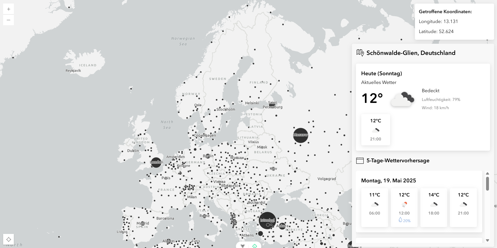

# Weather-App

This is a weather app based mainly on the ArcGIS Maps SDK for Javascript, @arcgis/map components, vue 3, typescript.



## Recommended IDE Setup

[VSCode](https://code.visualstudio.com/) + [Volar](https://marketplace.visualstudio.com/items?itemName=Vue.volar) (and disable Vetur).

VSCode: Open the root folder as a workspace.

## Type Support for `.vue` Imports in TS

TypeScript cannot handle type information for `.vue` imports by default, so we replace the `tsc` CLI with `vue-tsc` for type checking. In editors, we need [Volar](https://marketplace.visualstudio.com/items?itemName=Vue.volar) to make the TypeScript language service aware of `.vue` types.

## Customize configuration

See [Vite Configuration Reference](https://vite.dev/config/).

## Project Setup

Prerequisites: You need to have node LTS installed.

### API-Keys

This project uses the [Opencage Geocoder API](https://geocoder.opencagedata.com) and the [Open Weather Map API](https://geocoder.openweathermap.org/forecast5).

For both services, an API-Key is required.

Rename the file `.env.example` to `.env.local` and replace the placeholders with your own API-Keys.

### Install dependencies

```sh
npm ci
```

### Compile and Hot-Reload for Development

```sh
npm run dev
```

### Type-Check, Compile and Minify for Production

```sh
npm run build
```

### Run Unit Tests with [Vitest](https://vitest.dev/)

```sh
npm run test:unit
```

### Run End-to-End Tests with [Playwright](https://playwright.dev)

```sh
# Install browsers for the first run
npx playwright install

# When testing on CI, must build the project first
npm run build

# Runs the end-to-end tests
npm run test:e2e
# Runs the tests only on Chromium
npm run test:e2e -- --project=chromium
# Runs the tests of a specific file
npm run test:e2e -- tests/example.spec.ts
# Runs the tests in debug mode
npm run test:e2e -- --debug
```

### Lint with [ESLint](https://eslint.org/)

```sh
npm run lint
```

## Run production build in NGINX (Docker)

Prequisite: You need to have node.js and docker (docker desktop in windows or docker in linux) installed.

1. Set API keys in `.env.local`
2. Run `npm run build` to build the production build of the app.
3. Run `docker build -t weather-app .` to build the docker image.
4. Run `docker run --name weather-app -p 8080:80 weather-app` to build and start the container

5. To start and stop the container, run `docker start weather app` / `docker stop weather-app`
